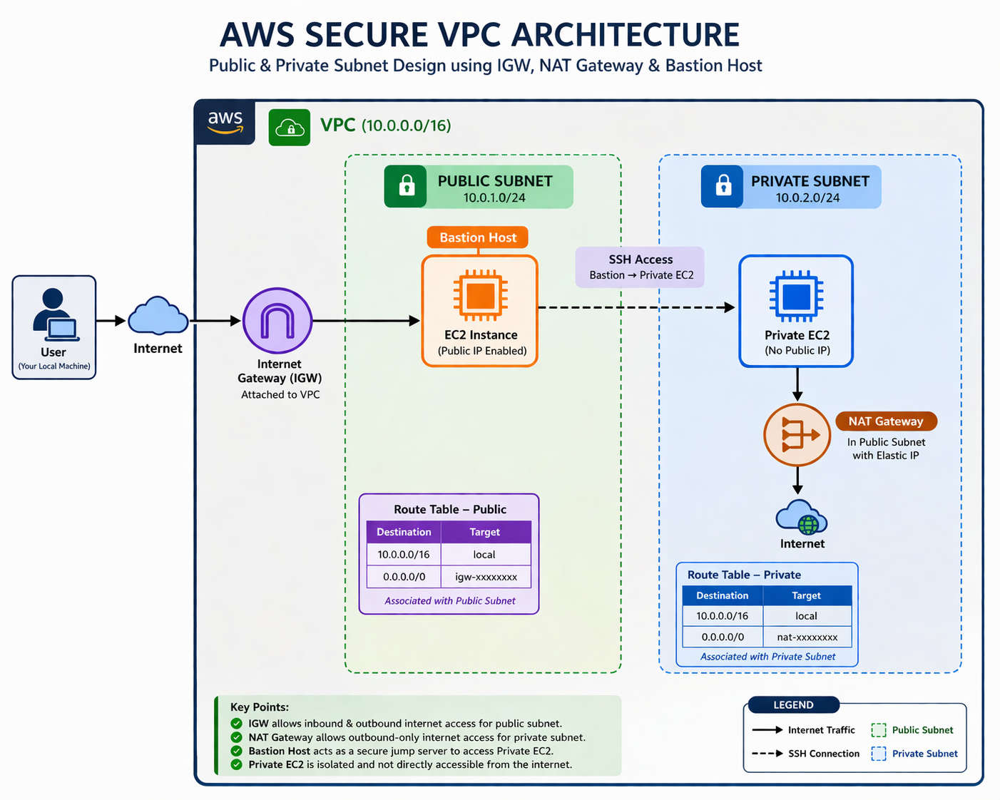

# 🚀 AWS Secure VPC Architecture

### 🔐 Production-Style Public & Private Subnet Design using IGW, NAT Gateway & Bastion Host

---

## 📌 Project Overview

Designed and implemented a **secure, production-grade AWS VPC architecture** that enforces:

* Network isolation
* Controlled access
* Minimal attack surface

This project demonstrates **real-world cloud engineering practices**, including secure networking, system design, and hands-on debugging.

---

## 🧠 Problem Statement

Default AWS setups often expose resources directly to the internet.

### ❌ Issues:

* Backend systems publicly accessible
* No controlled SSH access
* High attack surface

### ✅ Solution:

* Private subnet for backend isolation
* Bastion host for secure access
* NAT Gateway for outbound-only connectivity

---

## 🏗️ Architecture Diagram



---

## ⚙️ Core Architecture Components

| Component                  | Purpose                             |
| -------------------------- | ----------------------------------- |
| **VPC (10.0.0.0/16)**      | Isolated network environment        |
| **Public Subnet**          | Internet-facing resources           |
| **Private Subnet**         | Secure backend (no public IP)       |
| **Internet Gateway (IGW)** | Enables inbound & outbound internet |
| **NAT Gateway**            | Allows outbound-only internet       |
| **Bastion Host**           | Secure SSH access point             |
| **EC2 Instances**          | Compute layer                       |

---

## 🔁 Architecture Flow

```
User → Internet → IGW → Bastion Host (Public EC2)
                          ↓
                    Private EC2
                          ↓
                 NAT Gateway → Internet
```

### 🔐 Key Security Behavior:

* Private EC2 ❌ NOT accessible from internet
* Outbound internet ✅ via NAT Gateway
* SSH access ✅ only through Bastion

---

## 🔒 Security Design

* No public IP for private instances
* Bastion host acts as single entry point
* Security groups restrict SSH access
* Route tables enforce subnet isolation

### 🧩 Why Not Direct Public Access?

* Increases attack surface
* Violates least privilege principle
* Not suitable for production environments

---

## 🛠️ Implementation Highlights

* Created custom VPC with CIDR planning
* Configured public & private subnets
* Attached Internet Gateway
* Set up NAT Gateway with Elastic IP
* Deployed Bastion Host for SSH access
* Configured route tables for traffic control

---

## 🐞 Debugging & Real Experience

### Issue:

SSH connection failed due to permission error

### Root Cause:

Incorrect key file permissions

### Fix:

```bash
chmod 400 key.pem
```

### Commands Used:

```bash
ssh -i key.pem ec2-user@bastion-ip
ssh -i key.pem ec2-user@private-ip
```

👉 Demonstrates real **hands-on debugging and problem-solving**

---

## ✅ Validation & Proof

* Private EC2 → `ping google.com` ✅
* NAT Gateway working ✅
* Bastion SSH access working ✅
* Private EC2 not publicly accessible ✅

💡 **Core Guarantee:**

> Private EC2 can reach the internet, but the internet cannot reach it.

---

## 📂 Project Structure

```
aws-vpc-secure-architecture/
│
├── README.md
├── architecture/
├── documentation/
├── screenshots/
├── demo/
```

---

## 🎥 Demo Video

👉 [Watch Full Demo](demo/demo-video-link.md)

---

## 📘 Documentation

👉 Detailed explanation available here:
`documentation/AWS-Secure-VPC-Architecture-main.pdf`

---

## 📸 Screenshots

Refer to the `screenshots/` folder for:

* VPC setup
* Subnet configuration
* Route tables
* NAT Gateway
* Bastion SSH
* Validation proof

---

## 🎯 Key Learnings

* Difference between IGW and NAT Gateway
* Public vs Private subnet architecture
* Route tables control network flow
* Bastion host enhances security
* Real-world AWS networking implementation

---

## 🧠 Interview Readiness

This project enables you to confidently explain:

* Why private subnets are required
* How NAT Gateway works
* How Bastion improves security
* How route tables control traffic
* Real-world cloud architecture patterns

---

## 🚀 Outcome

This project demonstrates:

* ✅ Strong AWS fundamentals
* ✅ Secure system design
* ✅ Practical implementation
* ✅ Debugging experience

👉 Ready for **Cloud / DevOps Engineering roles**

---

## ⭐ If you found this useful

Give this repo a ⭐ and feel free to connect!

---

## 👨‍💻 Author

**Adhithyan Sivaraman T**  

🚀 Aspiring Cloud & DevOps Engineer

📬 Open to collaborate on cloud projects, DevOps setups, and real-world system design implementations.

---

## 🤝 Let’s Connect

* 📧 Email: [adhithyansivaraman@gmail.com](mailto:adhithyansivaraman@gmail.com)
* 💻 GitHub: https://github.com/Adhithyan-10
* 🔗 LinkedIn: https://www.linkedin.com/in/adhithyan-sivaraman-t-399b5b362

---

💡 Always excited to build, learn, and collaborate on impactful cloud engineering projects.
