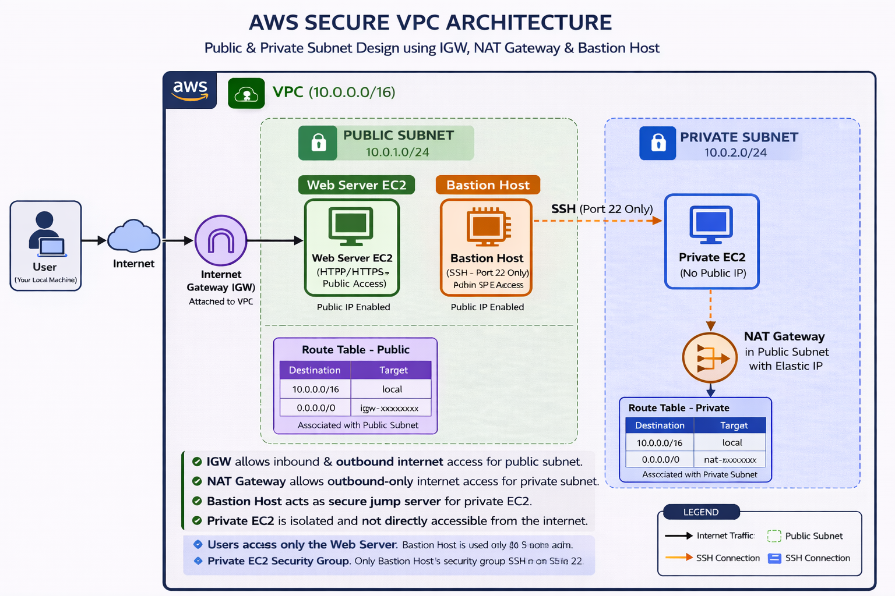

# 🏗️ Architecture Diagram — Secure AWS VPC

This folder contains the final architecture diagram for the **Secure AWS VPC Architecture** project.

---

## 📌 Architecture Overview

The architecture represents a **production-style AWS network design** with clear separation between public and private resources, following security best practices.

---

## 🔄 Traffic Flow Explained

### 🌐 1. User Access (Public Traffic)

- Users access the application through the internet  
- Traffic flows via **Internet Gateway (IGW)**  
- Requests reach the **Web Server EC2 (Public Subnet)**  
- Only **HTTP/HTTPS (Port 80/443)** is allowed  

---

### 🔐 2. Administrative Access (Secure SSH)

- Admin (developer) connects from local machine  
- Access is restricted using **Security Group (IP-based restriction)**  

SSH Flow:
```
Admin → Bastion Host → Private EC2
```

- Bastion Host acts as a **secure jump server**
- Private EC2 is **never directly exposed**

---

### 🔒 3. Private Instance Internet Access

- Private EC2 does not have a public IP  

Outbound Flow:
```
Private EC2 → NAT Gateway → Internet
```

- Used for:
  - Package installation
  - System updates
  - External API calls

---

## 🧠 Key Design Principles

- Least Privilege Access  
- Network Isolation (Public vs Private Subnets)  
- Controlled SSH Access via Bastion Host  
- No direct exposure of private resources  
- Secure outbound-only internet via NAT Gateway  

---

## 🔐 Security Implementation

### Bastion Host Security Group
- Allows SSH (Port 22) only from **admin's public IP**

### Private EC2 Security Group
- Allows SSH (Port 22) only from **Bastion Host Security Group**

---

## 🖼️ Architecture Diagram



---

## 🎯 Key Takeaway

This architecture ensures that:

- Public resources are accessible securely  
- Private resources remain isolated  
- Administrative access is controlled and secure  
- Internet access is properly routed and restricted  

---

🚀 This setup reflects a **real-world secure AWS networking architecture** used in production environments.
